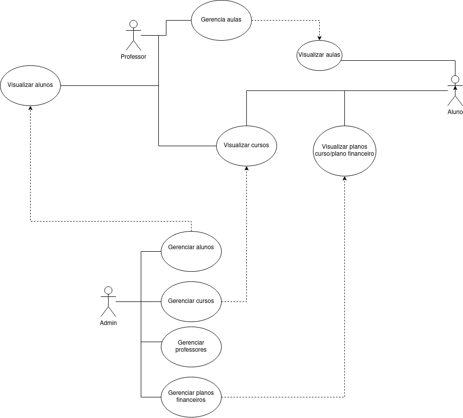
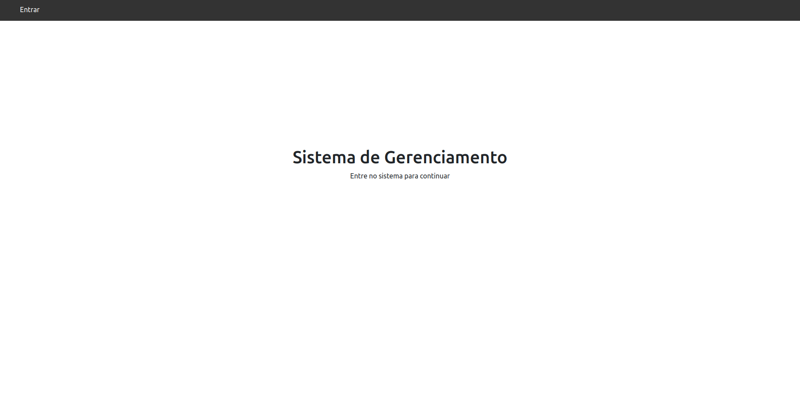
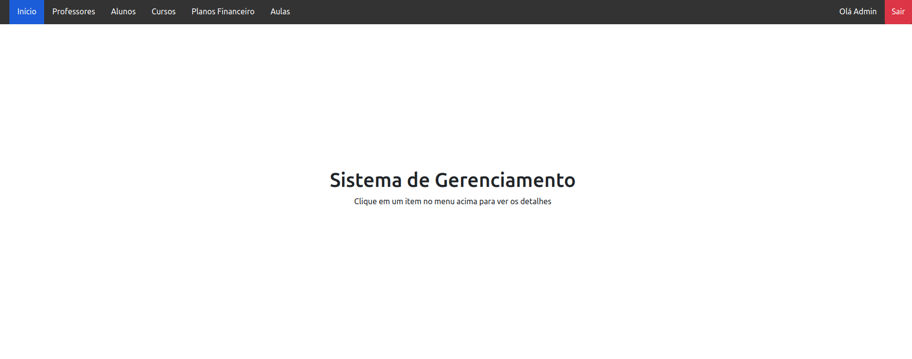
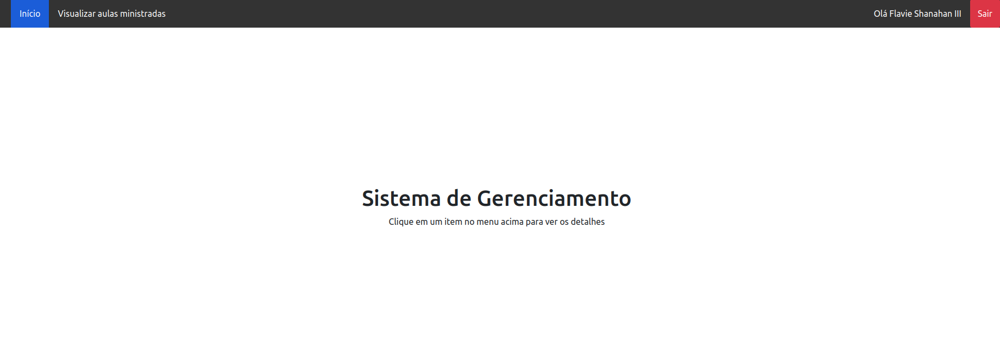
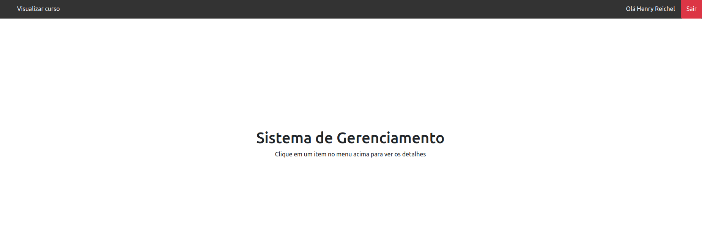

<p align="center"><a href="https://laravel.com" target="_blank"></a></p>


# Sistema de Gerenciamento de escola

## Descrição do Projeto
<p>Trabalho do curso SPACE TECH da Soluti Digital.</p>
<p>Em parceria com a prefeitura de Vila Nova - Goiás, nossa empresa juntamente com o DP
de Tecnologia e Desenvolvimento abraçamos um projeto que visa atender a uma
instituição de ensino superior privado que concederá bolsas de estudo com o plano
financeiro em 100%, ou seja, quando o plano financeiro tiver desconto de 100% a
mensalidade será gratuita para esse aluno.:</p>
<br>CRUD de professores
<br>CRUD de alunos
<br>CRUD de cursos
<br>CRUD de planos financeiros
<br>CRUD de aulas
<br>

## Rotas especificas para a API
<br>Listagem de professores
<br>Listagem de alunos por curso
<br>Listagem de aulas por curso
<br>Listagem de cursos ativados/desativados
<br>Listagem de aulas por aluno + valor de mensalidade
<br>Filtragem de resultados por campos

## Diagrama de casos de uso



* Inicio da Aplicação


* Visão do ADMIN


* Visão do professor


* Visão do Estudante



### Pré-requisitos

Antes de começar, você vai precisar ter instalado em sua máquina as seguintes ferramentas:
[Git](https://git-scm.com), [Composer](https://getcomposer.org/), [MySql](https://www.mysql.com/), [Apache](https://www.apache.org/) e/ou [Xampp](https://www.apachefriends.org/pt_br/index.html). 
Além disto é bom ter um editor para trabalhar com o código como [VSCode](https://code.visualstudio.com/)

### 🎲 Rodando o Sistema

```bash
# Clone este repositório
$ git clone <https://github.com/RafaelMakiyama/TrabalhoSpaceTech>

# Acesse a pasta do projeto no terminal/cmd
$ cd TrabalhoSpaceTech

# Vá para a pasta do projeto
$ cd app3

# Instale as dependências
$ composer install

# Criar um banco de dados MySql

# Copiar o .env.example para .env e realizar os ajustes de Banco de Dados com o banco criado anteriormente

# Execute o comando para gerar a Key
$ php artisan key:generate


# Rodar as migrations para criar as tabelas no banco de dados
$ php artisan migrate

# Execute popular a seeder, junto com as regras do setup ACL e as seeders das tabelas
# Irá ser criado 1 usuário admin, 8 cursos, 5 planos financeiros, 10 professores, 50 alunos e 50 aulas
$ php artisan db:seed

# Execute a aplicação em modo de desenvolvimento
$ php artisan serve

# O servidor inciará na porta:8000 
- acesse <http://localhost:8000>
```
## Rotas da API

As rotas da API estão disponibilizadas no arquivo  **Aceleracao PHP App 3.postman_collection**

## Observações
<ul>
    <li>Todos os usuários de estudante/professor/admin criados pela seeder, terão como padrão a senha "password"</li>
    <li>Os alunos e professores criados terão o seguinte padrão de senha: primeiro nome + os 3 primeiros caracteres da matrícula<br></li>
    <b>Exemplo: </b><br>
    
        Nome completo: Fulano da Silva, Matrícula: 1234
        Senha: Fulano123
</ul> 
<ul>
    <li>O email do admin é <b>admin@admin.com</b> e a senha: <b> password</b</li>
</ul>
### 🛠 Tecnologias utilizadas

As seguintes ferramentas foram usadas na construção do projeto:

- [PHP](https://www.php.net/)
- [Laravel](https://laravel.com/)
- [Git](https://git-scm.com)
- [Composer](https://getcomposer.org/)
- [MySql](https://www.mysql.com/)
- [Apache](https://www.apache.org/)
- [Xampp](https://www.apachefriends.org/pt_br/index.html)

<br><br>

### Autores

<table>
  <tr>
    <td align="center"><a href="https://github.com/RafaelMakiyama"><br /><sub><b>RafaelMakiyama</b></sub></a><br /><a href="https://github.com/RafaelMakiyama/" title="RafaelMakiyama">🚀</a></td>
    <td align="center"><a href="https://github.com/evaldorcardoso"><br /><sub><b>evaldorcardoso</b></sub></a><br /><a href="https://github.com/evaldorcardoso" title="evaldorcardoso">🚀</a></td>
    <td align="center"><a href="https://github.com/Anadinho"><br /><sub><b>GABRIEL ANADINHO</b></sub></a><br /><a href="https://github.com/Anadinho" title="GABRIEL ANADINHO">🚀</a></td>
    <td align="center"><a href="https://github.com/filipesander"><br /><sub><b>Filipe Sander</b></sub></a><br /><a href="https://github.com/filipesander/" title="Filipe Sander">🚀</a></td>
    <td align="center"><a href="https://github.com/FelipeSNeves"><br /><sub><b>Felipe S. Neves</b></sub></a><br /><a href="https://github.com/FelipeSNeves" title="Felipe S. Neves">🚀</a></td>
  </tr>  
</table>

MIT License

Copyright (c) <2021>

Permission is hereby granted, free of charge, to any person obtaining a copy
of this software and associated documentation files (the "Software"), to deal
in the Software without restriction, including without limitation the rights
to use, copy, modify, merge, publish, distribute, sublicense, and/or sell
copies of the Software, and to permit persons to whom the Software is
furnished to do so, subject to the following conditions:

The above copyright notice and this permission notice shall be included in all
copies or substantial portions of the Software.

THE SOFTWARE IS PROVIDED "AS IS", WITHOUT WARRANTY OF ANY KIND, EXPRESS OR
IMPLIED, INCLUDING BUT NOT LIMITED TO THE WARRANTIES OF MERCHANTABILITY,
FITNESS FOR A PARTICULAR PURPOSE AND NONINFRINGEMENT. IN NO EVENT SHALL THE
AUTHORS OR COPYRIGHT HOLDERS BE LIABLE FOR ANY CLAIM, DAMAGES OR OTHER
LIABILITY, WHETHER IN AN ACTION OF CONTRACT, TORT OR OTHERWISE, ARISING FROM,
OUT OF OR IN CONNECTION WITH THE SOFTWARE OR THE USE OR OTHER DEALINGS IN THE
SOFTWARE.
